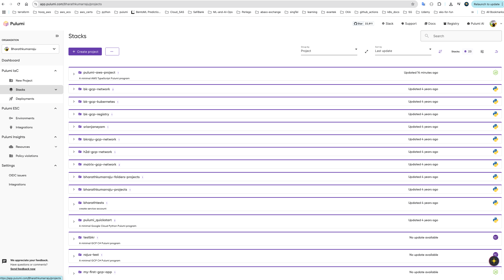
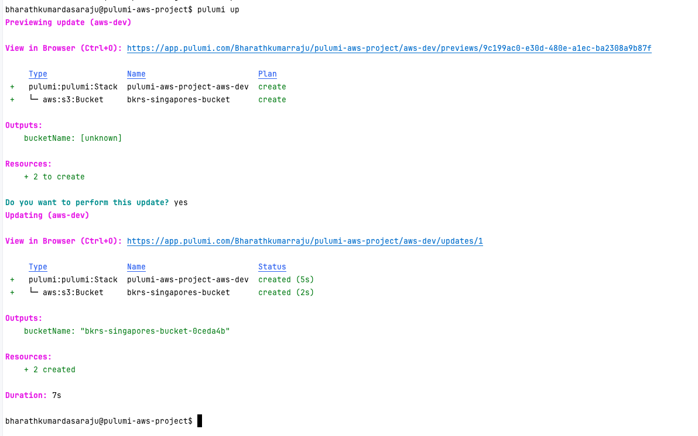

# iac-with-pulumi
IaC with pulumi


## Bharaths Pulumi app



### pulumi aws


### pulumi stacks
```shell

bharathkumardasaraju@pulumi-aws-project$ pulumi stack init sandbox
Created stack 'sandbox'
bharathkumardasaraju@pulumi-aws-project$ pulumi stack init production
Created stack 'production'
bharathkumardasaraju@pulumi-aws-project$ pwd
/Users/bharathkumardasaraju/external/iac-with-pulumi/demo1/lab2/pulumi-aws-project
bharathkumardasaraju@pulumi-aws-project$ pulumi config set region ap-south-1 --stack sandbox
bharathkumardasaraju@pulumi-aws-project$ pulumi config set region ap-south-1 --stack production
bharathkumardasaraju@pulumi-aws-project$ pulumi stack init dev
Created stack 'dev'
bharathkumardasaraju@pulumi-aws-project$ pulumi config set region ap-south-1 --stack dev       
bharathkumardasaraju@pulumi-aws-project$       


bharathkumardasaraju@pulumi-aws-project$ pulumi up --stack dev
Previewing update (dev)

View in Browser (Ctrl+O): https://app.pulumi.com/Bharathkumarraju/pulumi-aws-project/dev/previews/6dc06d47-215a-48a2-9f14-43b68fc63f84

     Type                 Name                    Plan       
 +   pulumi:pulumi:Stack  pulumi-aws-project-dev  create     
 +   └─ aws:s3:Bucket     bkrs-singapores-bucket  create     

Outputs:
    bucketName: [unknown]

Resources:
    + 2 to create

Do you want to perform this update? yes
Updating (dev)

View in Browser (Ctrl+O): https://app.pulumi.com/Bharathkumarraju/pulumi-aws-project/dev/updates/1

     Type                 Name                    Status           
 +   pulumi:pulumi:Stack  pulumi-aws-project-dev  created (5s)     
 +   └─ aws:s3:Bucket     bkrs-singapores-bucket  created (2s)     

Outputs:
    bucketName: "bkrs-singapores-bucket-185a737"

Resources:
    + 2 created

Duration: 7s

bharathkumardasaraju@pulumi-aws-project$ pulumi up --stack dev
Previewing update (dev)

View in Browser (Ctrl+O): https://app.pulumi.com/Bharathkumarraju/pulumi-aws-project/dev/previews/0125f82b-713f-4181-a4c3-320e2f5f279a

     Type                 Name                    Plan     
     pulumi:pulumi:Stack  pulumi-aws-project-dev           

Resources:
    2 unchanged

Do you want to perform this update? yes
Updating (dev)

View in Browser (Ctrl+O): https://app.pulumi.com/Bharathkumarraju/pulumi-aws-project/dev/updates/2

     Type                 Name                    Status     
     pulumi:pulumi:Stack  pulumi-aws-project-dev             

Outputs:
    bucketName: "bkrs-singapores-bucket-185a737"

Resources:
    2 unchanged

Duration: 2s

bharathkumardasaraju@pulumi-aws-project$ pwd
/Users/bharathkumardasaraju/external/iac-with-pulumi/demo1/lab2/pulumi-aws-project
bharathkumardasaraju@pulumi-aws-project$ 

```

#### from linkedin learning

https://www.linkedin.com/learning/multicloud-application-infrastructure-as-code-with-pulumi/manage-stacks-and-configurations-with-pulumi
